# [20200708] Github Pages 教學

## 1. 在 Github官網 (https://github.com/) 註冊帳號


## 2. 建立一個「新的資料庫(New repository)」(https://github.com/new)

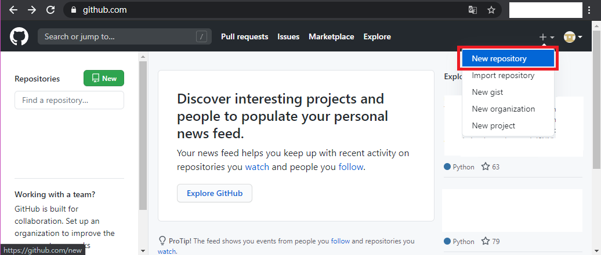

## 3. 建立一個 <u>GitHub帳號</u> 同樣名稱+「.github.io」的<u>儲存庫名稱</u>(Repository name)

- ### 例如: <u>GitHub帳號名稱</u> 為「username」，則 <u>儲存庫名稱</u> 就取為「username.github.io」。

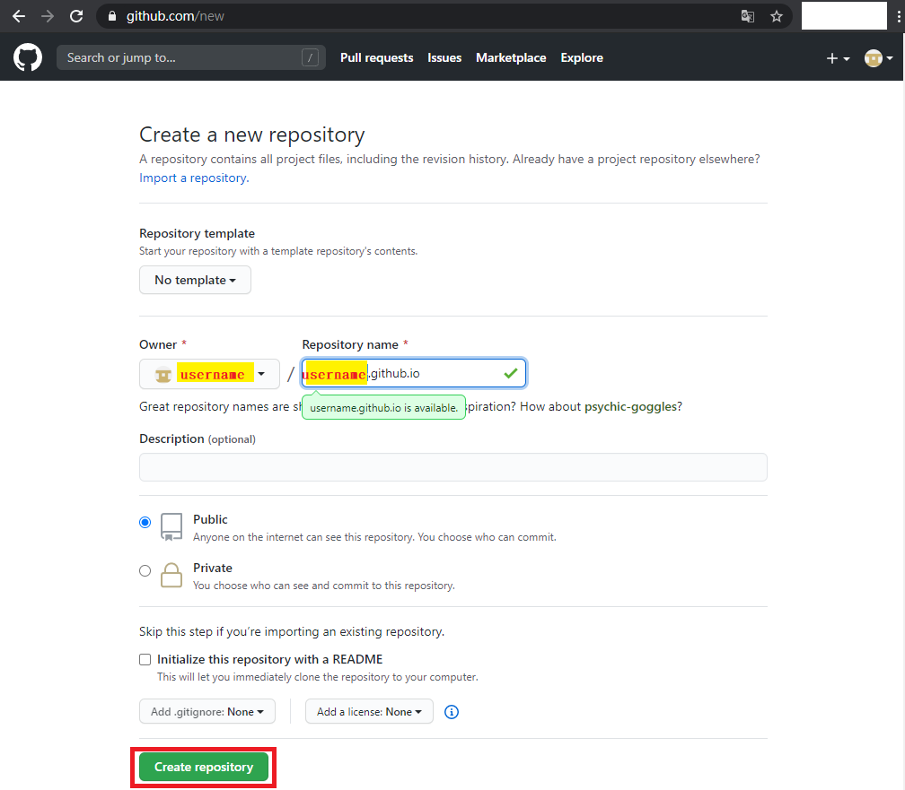

## 4. 進入該專案後，點選「Setting」進入設定頁面內。

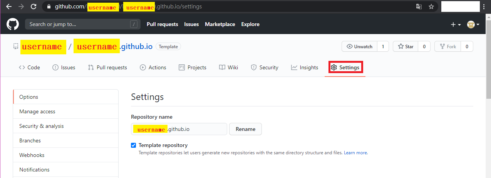

## 5. 往下滑，滑到「Github Pages」，點選「Change theme」。

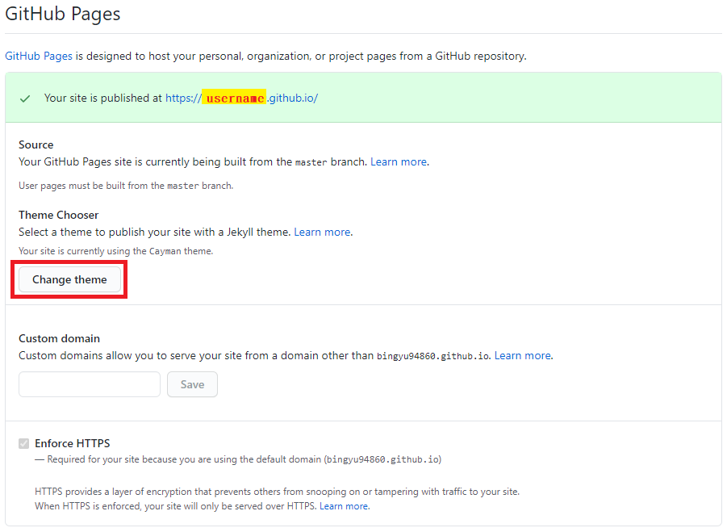

## 6. 選擇一個妳喜歡的主題，最後並點選「Select theme」。

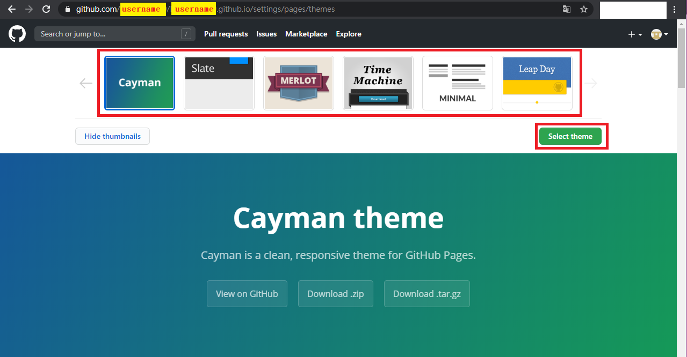

## 7. 基本上這樣子，就已經建立好自己網站了，可以試試在網址輸入 username.github.io (username 需改成自己 <u>GitHub帳號名稱</u>)，進去看看了!


## 8. 我們進去專案裡面，點選「Code」會看到有三個檔案，依序說明。

- ### 首先「README.md」為專案主頁下方所呈現給其他用戶對於該專案的說明(給其他人看的)。

- ### 再來「_config.yml」是用來設定部落格相關資訊，例如:設定網頁風格主題(theme)...等。

- ### 最後「index.md」就是個人網站一進去的主頁面。

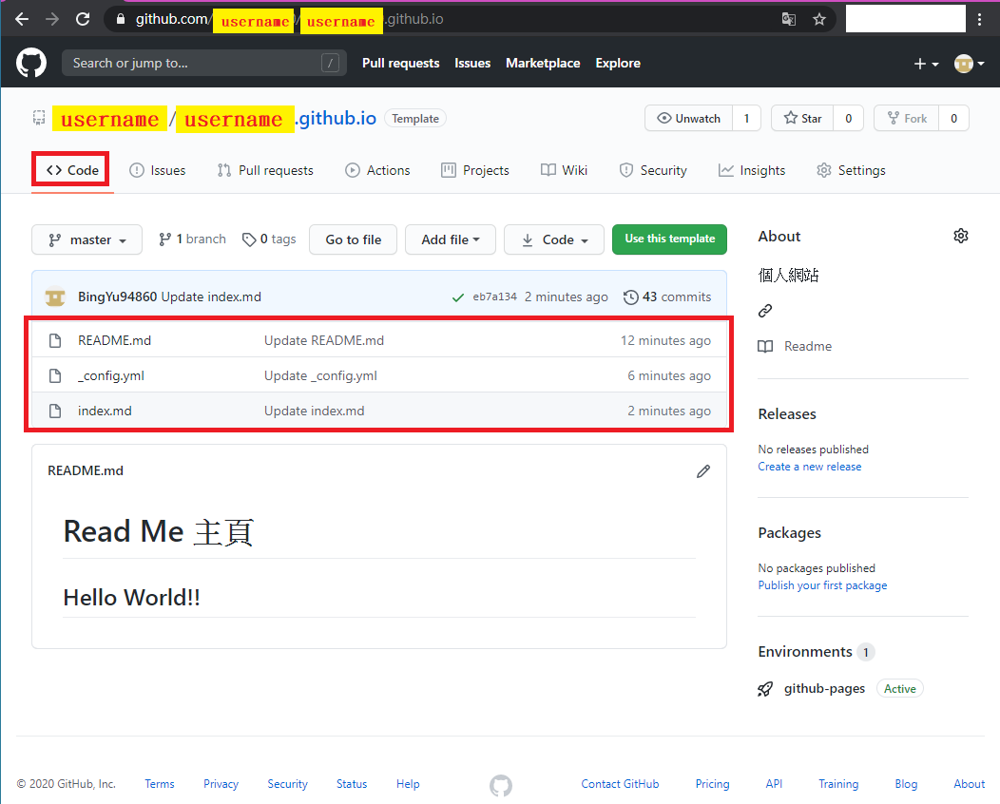

## 9. 我們點選「_config.yml」的檔案，並按下編輯。

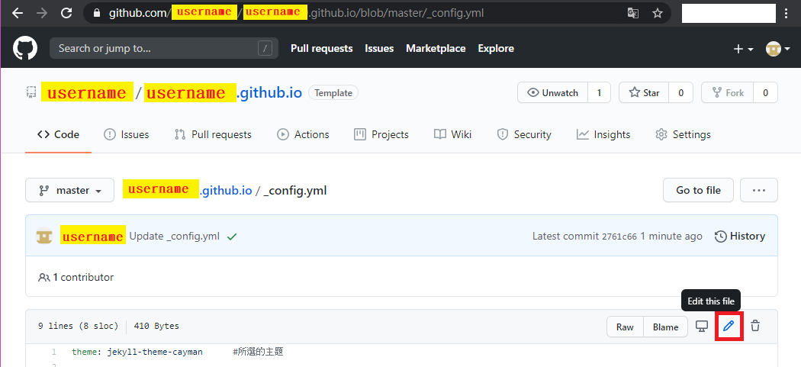

- ### 進去後，我們編輯以下的相關資訊。

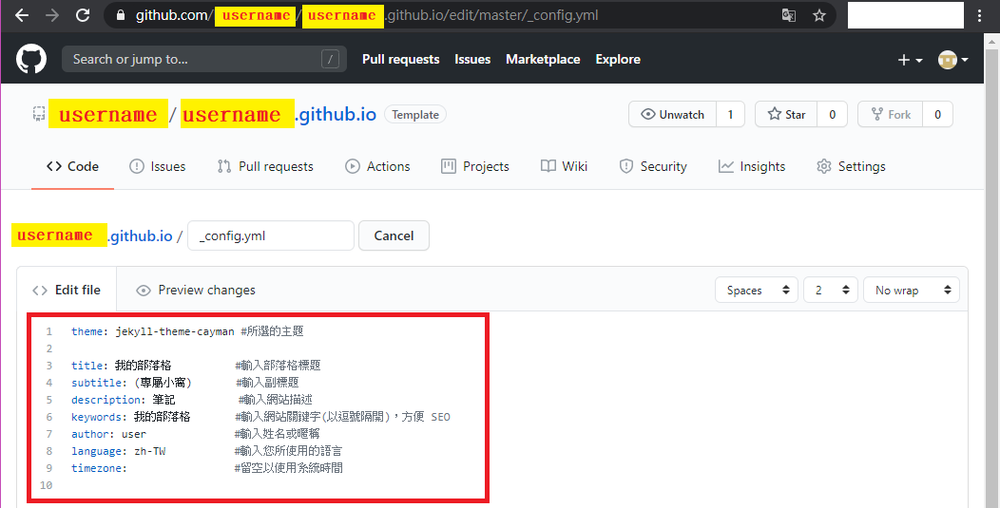

- ### 可以直接複製的 (#以後都是註解)

```yaml
theme: jekyll-theme-cayman #所選的主題
                           
title: 我的部落格	 #輸入部落格標題
subtitle: (專屬小窩)  #輸入副標題
description: 筆記	   #輸入網站描述 
keywords: 我的部落格	 #輸入網站關鍵字(以逗號隔開)，方便 SEO 
author: user		#輸入姓名或暱稱
language: zh-TW		#輸入您所使用的語言
timezone:			#留空以使用系統時間
```

- ### 編輯完，按下「Commit changes」，保存剛剛所寫的。

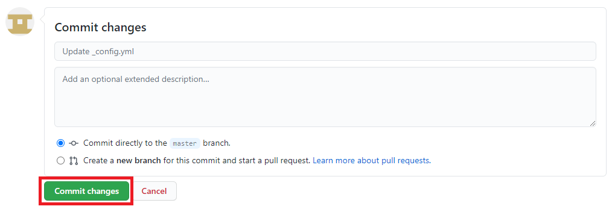

## 10. 我們點選「index.md」的檔案，並按下編輯，編輯我們個人網站所要顯示的內容(如下圖紅框)。

- ### 語法為 Markdown，在這推薦一個編輯軟體 [Typora](https://www.typora.io/#windows) 給初次接觸的人，可以用來編輯自己的主頁。

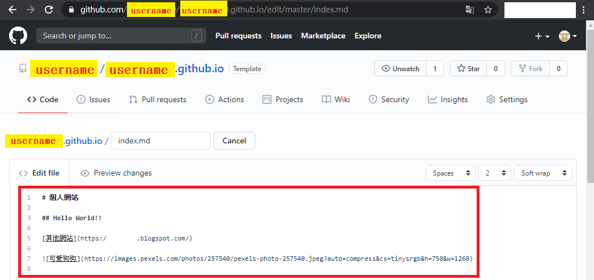

- ### 可以直接複製的

```
# 個人網站

## Hello World!!

[其他網站](https://www.google.com/) 


```

## 11. 完成後，可以再次進入我們個人網站看看!

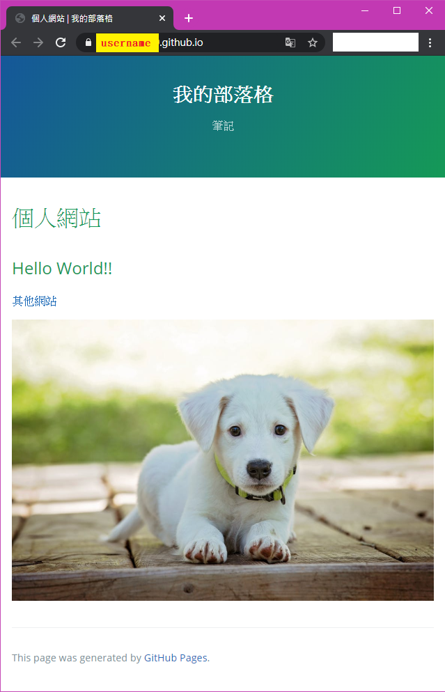


